<!--
  This is your PROFILE README. It goes in a repo named exactly after your
  username (e.g. github.com/Roshan0102/Roshan0102) so GitHub shows it on your profile.
-->

<table>
<tr>
<td valign="top"></td>
<td valign="top"></td>
</tr>
</table>

## Roshan J

**Cloud & DevOps Engineer · AWS Certified · Automation & GitOps**

 

<!-- animated contribution graph, refreshed daily by the workflow -->

